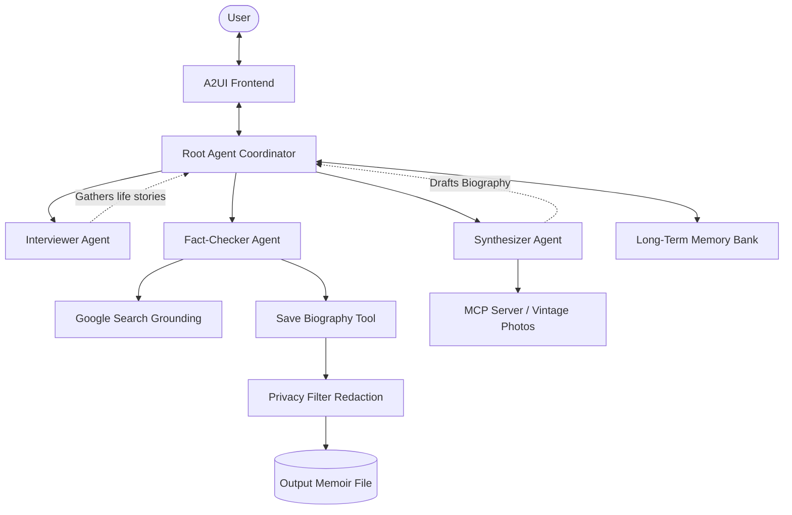

# Memoir: The Digital Legacy Architect

**Memoir** is an autonomous multi-agent orchestration system designed to solve a deeply human problem: preserving the stories, memories, and photos of older generations before they are lost.

## Vibe Coding: The Digital Scrapbook UI

By leveraging A2UI (Agent-to-UI), Memoir breaks out of the terminal and generates a beautiful, interactive "Digital Scrapbook" aesthetic dynamically:


## Architecture & "Wow Factor" Features

Memoir is built using the Google ADK and features:
1. **Beautiful Web UI (A2UI)**: Dynamic Glassmorphism UI rendering.
2. **Infinite Long-Term Memory (Memory Bank)**: Remembers user interactions across days using the `PreloadMemoryTool`.
3. **Fact-Checker Agent**: A specialized agent that uses Google Search to mitigate hallucination and verify historical events before saving.
4. **Privacy Security**: A custom redaction filter for SSNs and phone numbers.



## Project Structure

```
memoir-agent/
├── app/         # Core agent code
│   ├── agent.py               # Main agent logic
│   └── app_utils/             # App utilities and helpers
├── tests/                     # Unit, integration, and load tests
├── GEMINI.md                  # AI-assisted development guide
└── pyproject.toml             # Project dependencies
```

> 💡 **Tip:** Use [Gemini CLI](https://github.com/google-gemini/gemini-cli) for AI-assisted development - project context is pre-configured in `GEMINI.md`.

## Requirements

Before you begin, ensure you have:
- **uv**: Python package manager (used for all dependency management in this project) - [Install](https://docs.astral.sh/uv/getting-started/installation/) ([add packages](https://docs.astral.sh/uv/concepts/dependencies/) with `uv add <package>`)
- **agents-cli**: Agents CLI - Install with `uv tool install google-agents-cli`
- **Google Cloud SDK**: For GCP services - [Install](https://cloud.google.com/sdk/docs/install)


## 🚀 How to Run the Project

Memoir is built using the Google ADK. To launch the interactive local development server and test out the new features (like Voice and A2UI), follow these steps:

1. **Install Dependencies**:
   ```bash
   agents-cli install
   ```
2. **Launch the Playground**:
   ```bash
   agents-cli playground
   ```
   *(Note: The MCP Server for local photos is automatically launched as a background subprocess when the agent runs.)*

3. **Test the Voice Feature**:
   Once the playground UI opens in your browser, don't just type! Click the **Microphone** icon to send a voice note to the Interviewer Agent and watch it natively process the audio.

## ⚖️ How to Run Automated Evaluations (AI-as-Judge)

We have built a custom evaluation dataset to prove that our Guardrails (Fact-Checker and Privacy Filter) work at scale. 

To run the automated evaluation pipeline:
```bash
agents-cli eval run
```
This command will execute the mock scenarios in `tests/eval/datasets/mock_dataset.json` and generate an HTML report proving that:
- The Privacy Filter catches SSN leaks (Safety Metric).
- The Fact-Checker catches timeline inconsistencies (Hallucination Metric).

## 🛠️ Project Management

| Command | What It Does |
|---------|--------------|
| `agents-cli lint` | Run code quality checks |
| `agents-cli deploy` | Deploy the project to production |
| `agents-cli scaffold enhance` | Add CI/CD pipelines and Terraform infrastructure |
| `agents-cli infra cicd` | One-command setup of entire CI/CD pipeline + infrastructure |
| `agents-cli scaffold upgrade` | Auto-upgrade to latest version while preserving customizations |

---

## Development

Edit your agent logic in `app/agent.py` and test with `agents-cli playground` - it auto-reloads on save.

## Deployment

```bash
gcloud config set project <your-project-id>
agents-cli deploy
```

To add CI/CD and Terraform, run `agents-cli scaffold enhance`.
To set up your production infrastructure, run `agents-cli infra cicd`.

## Observability

Built-in telemetry exports to Cloud Trace, BigQuery, and Cloud Logging.
